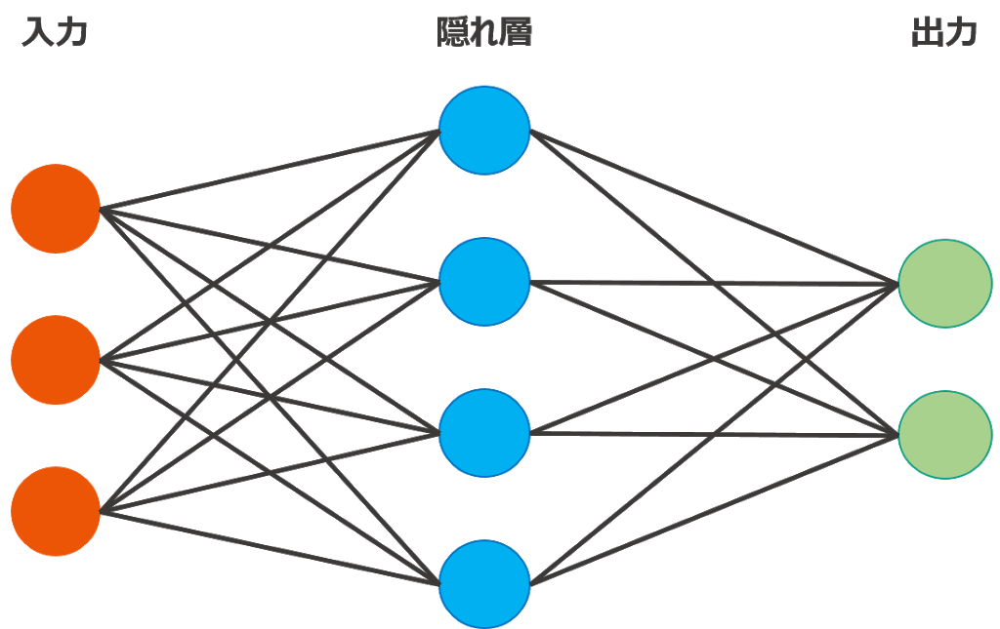

# AIについての勉強1日目
しばらくはAI、機械学習、ディープラーニングがなにかというのを勉強していく。

## 目次

<!-- TOC depthFrom:2 -->

- [AIについての勉強1日目](#aiについての勉強1日目)
  - [目次](#目次)
  - [AIの段階](#aiの段階)
    - [第1段階「古典的な人工知能」](#第1段階古典的な人工知能)
    - [第2段階「機械学習」](#第2段階機械学習)
    - [第3段階「ディープラーニング」](#第3段階ディープラーニング)
    - [スマートスピーカー](#スマートスピーカー)

<!-- /TOC -->

## AIの段階
AIと一口に言っても3段階の段階がある。

### 第1段階「古典的な人工知能」
・古典的な人工知能
「推論」「探索」して解を導き出す

実用例
・将棋AI
・掃除ロボット

### 第2段階「機械学習」
・機械学習
AI自らが大量のデータを分類する方法を学習する。
Googleの検索エンジン等が代表的

### 第3段階「ディープラーニング」
深層学習とも呼ばれる。
画像や映像などからコンピューターが「実世界を認識する」のが特徴。
複数の動物の画像を見て、猫はこれと人間は瞬時に判断できる。

そういった判断をコンピューターにさせるのがディープラーニング。

人間の脳神経回路を模した「ニューラルネットワーク」というアルゴリズムを何層にも重ねて、総合的な判断をする。

### スマートスピーカー
身近になりつつあるAIを活用した製品。
各社が様々なAIを開発し、しのぎを削っている。

Googleの「Googleアシスタント」、Amazonの「Alexa」、Microsoftの「Cortana」、LINEの「Clova」、Appleの「Siri」などなど

