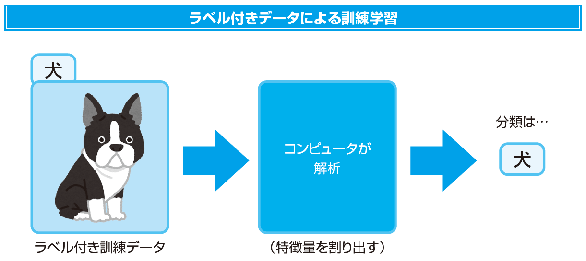
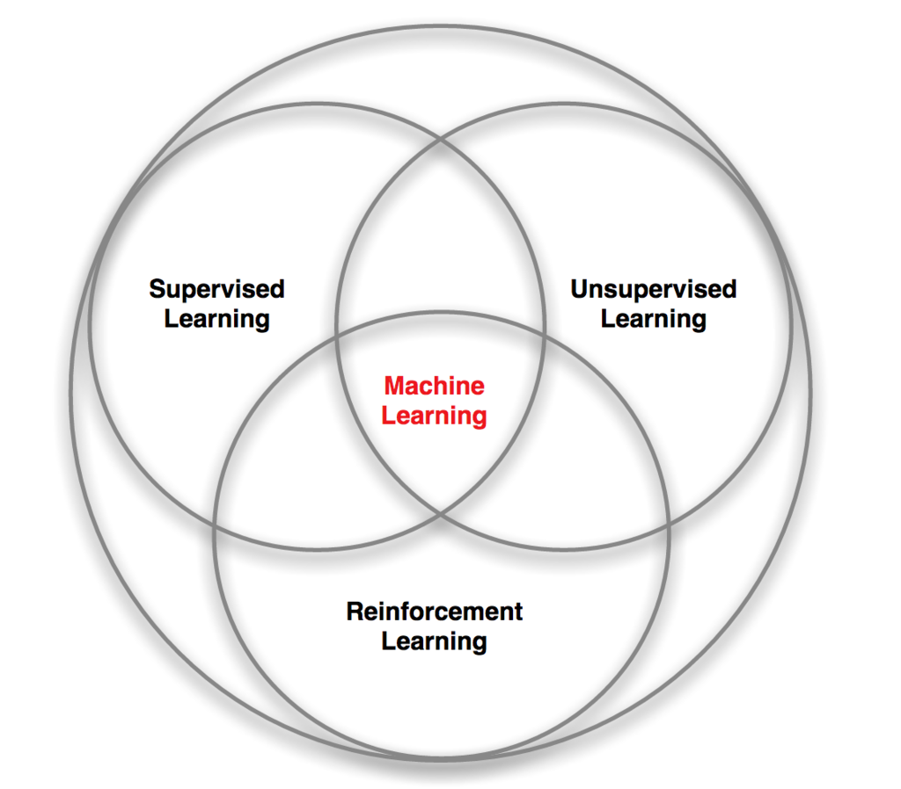

## 目次

<!-- TOC depthFrom:2 -->

- [目次](#目次)
- [人工知能は特定の分野に特化したモデルにするほうが良い](#人工知能は特定の分野に特化したモデルにするほうが良い)
- [音声認識や画像認識はディープラーニング](#音声認識や画像認識はディープラーニング)
- [教師あり学習 と 教師なし学習](#教師あり学習-と-教師なし学習)
  - [教師あり学習](#教師あり学習)
  - [教師なし学習](#教師なし学習)
  - [教師あり学習をもとに、教師なし学習をさせる](#教師あり学習をもとに教師なし学習をさせる)
- [教師なし学習による「強化学習」](#教師なし学習による強化学習)
- [教師あり学習 教師なし学習 強化学習 をあわせて機械学習](#教師あり学習-教師なし学習-強化学習-をあわせて機械学習)

<!-- /TOC -->

## 人工知能は特定の分野に特化したモデルにするほうが良い
汎用的な人工知能の作成は困難と言われている。
これは人と同じで、得意な分野については正確にはっきりと答えることができるが、知らない分野については曖昧な答えを返してしまう。

人工知能も同じで、返答の精度を上げるのであれば特定の分野に特化した人工知能を作る必要がある。
何にでも使える汎用的な人工知能の研究が進められているが、成果はあまり良くない。

## 音声認識や画像認識はディープラーニング

音声認識や画像認識、自然言語処理の分野ではディープラーニングが用いられる。

ディープラーニングは人の脳神経回路を模したニューラルネットワークによって認識を行う。

例えば、膨大な画像の中から「猫」の画像のみを選ぶためには「耳が三角っぽい」「しっぽが生えている」「ひげが生えている」などの特徴量を学習させることで判断が可能となるが、「耳が三角っぽくない」「しっぽが短い」「ひげが見えにくい」などの特徴を持った猫もいるだろう。

そういった猫っぽい特徴が少ない猫でも「猫」だと認識するにはディープラーニングが有効である。

ディープラーニングでは判断すべきものの特徴をコンピューターが自動で判別してモデル化するため、人間が特徴を1つ1つ教えることなく学習させることが可能。

## 教師あり学習 と 教師なし学習
人工知能の学習にも教師の有無がある。
ここでいう教師とは「人間」のことである。

### 教師あり学習

人工知能の学習の際に人間がデータを渡す時に「正解データ」と渡す子で、正解を見極めることができるようになる学習方法。
例えば、「これは犬だよ」と言って画像を渡すことで、人工知能は「これは犬」と認識した上で特徴を学習する。

つまり「入力データ」を与える際に、人間が「出すべき答え」を提示すること。
そうすることで、人工知能が入力データに関する特徴をモデル化する。

### 教師なし学習
教師なし学習では「正解データ」が与えられていないのが特徴。
データを渡す時に正解データを設定せずに解析させる方法。

教師なし学習はビックデータの解析などに使われることが多い。
ビックデータの解析には人間が正解を教えるより、より使える情報を導き出せることが多いためだ。

「お酒を買う人の中にはおむつを買う人が多い」などの一見すると関連性のなさそうなデータを導き出すこともある。

2012年にGoogleが「人が教えることなく、AIが自発的に猫を認識することができた」と発表し、大きな話題となった。
YouTube動画の画像などを中心に学習し、AIが自発的に猫を認識できるようになったのだ。

### 教師あり学習をもとに、教師なし学習をさせる
教師あり学習をもとに、教師なし学習をさせるハイブリッドな方式も採用されている。

Googleの囲碁AI「[AlphaGo](https://ja.wikipedia.org/wiki/AlphaGo)」では、インターネット上の囲碁対局サイトにある3000万”手”のデータをもとに教師あり学習をさせた。
その後、コンピューター同士で囲碁の対局を3000万”局”ほど実施し、さらに学習を重ねたのだ。

「3000万手の教師あり学習」と「3000万局の教師なし学習」により、2015年には人間のプロ囲碁棋士をハンデなしで破ることに成功した。

AlphaGoは日々アップグレードが行われており、最新の「[AlphaZero](https://ja.wikipedia.org/wiki/AlphaGo_Zero)」はTPU 5000台を使用し、2時間で将棋、4時間でチェスの最高峰AIに勝利、前世代である「[AlphaGo Zero](https://ja.wikipedia.org/wiki/AlphaZero)」を8時間で上回った。

## 教師なし学習による「強化学習」
昨今では「強化学習」が注目されている。

人間の学習における「慣れ」や「コツ」に分類される学習をAIで実施する方法だ。
「価値を最大化するような行動」とも言われ、より高得点、高報酬を狙うためにする学習方法。

強化学習には「報酬」が必要で、「どのような結果を得ると良い」というルールを決める必要がある。

例えば、Google DeepMindの「[DQN](https://ja.wikipedia.org/wiki/DQN_(%E3%82%B3%E3%83%B3%E3%83%94%E3%83%A5%E3%83%BC%E3%82%BF))」ディープラーニングの学習アルゴリズムを利用し、一部の電子ゲームで人間を超えるスコアを獲得することができる。

DQNはブロック崩しゲームのルールをコンピューターが自分で学習し、人間を超えるプレイを可能とした。

DQNには「高得点を目指す」ことだけが教えられており、それ以外の行動はすべてDQNが自身で学んだという。
DQNは最初、意味もわからず、落ちてくるボールを見過ごしていたが、偶然ボールを弾いてブロックに当たったことで得点が入ることを学習した。
「ボールを弾く → 得点が入る」と学習したDQNは学習を開始し、人間を超えるスコアを叩き出すほどのAIにまで「強化学習」で到達した。

しかし、そんなスーパーAIのDQNにも、弱点が存在するという。

DQNは従来の人工知能とは異なり、「ゲームのルールを予め教わることなくランダムに操作していた」ため、特定のゲームではスコアが伸びなかったという。

DQNは偶然を積み重ねて学習し、操作しているので、パックマン風のゲームでは数秒先の状況を考えることができず、スコアが伸ばせなかった。

## 教師あり学習 教師なし学習 強化学習 をあわせて機械学習

機械学習の分類方法の中に、教師あり学習、教師なし学習、強化学習という3種類に分けて分類するという考え方がある。

これらを目的に合わせて使い分けることが「より良いAI」への近道と言えるだろう。

教師あり学習は「入力と出力の関係」を学習するもの。
教師なし学習は「データの構造」を学習するもの。
強化学習は「価値の最大化」を学習するもの。

参考文献：[人工知能はどうやって「学ぶ」のか――教師あり学習、教師なし学習、強化学習 \(1/2\)：ロボットをビジネスに生かすAI技術（2） \- ＠IT](https://www.atmarkit.co.jp/ait/articles/1610/01/news002.html)