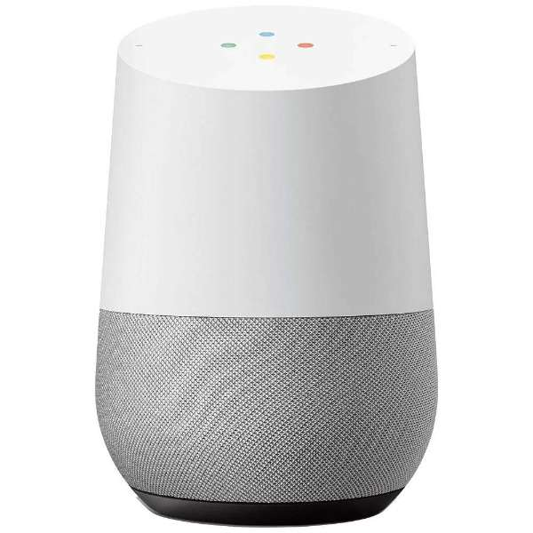
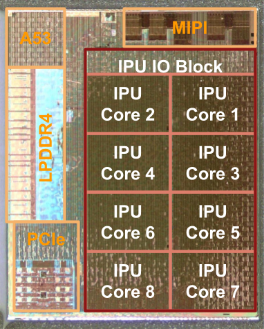
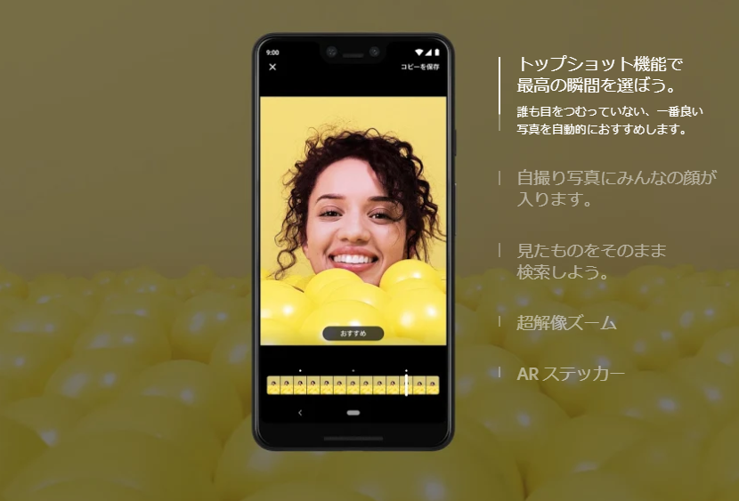
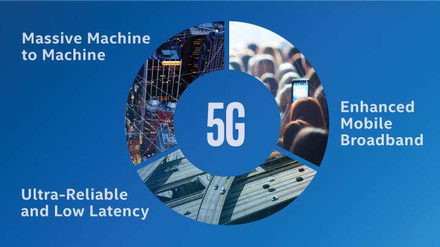

# AIの活用事例

## 目次

<!-- TOC depthFrom:2 -->

- [AIの活用事例](#aiの活用事例)
  - [目次](#目次)
  - [スマートスピーカー](#スマートスピーカー)
  - [AIによるスマホの制御](#aiによるスマホの制御)
  - [AIによるチャットボットの導入](#aiによるチャットボットの導入)
  - [モバイルネットワーク技術の発展により、さらに需要が上がる？](#モバイルネットワーク技術の発展によりさらに需要が上がる)

<!-- /TOC -->

## スマートスピーカー

Google、Amazon、LINE、Microsoft、AppleなどのIT大手企業が展開するのがAI搭載の「スマートスピーカー」という製品だ。
Googleは「Googleアシスタント」、Amazonは「Alexa」、LINEは「Clova」、Microsoftは「Cortana」、Appleは「Siri」を利用し、様々なサービスを提供している。

これらのほとんどは、本体自体にはAIとしての機能は搭載されおらず、サーバーとの通信によってユーザーの声を認識し、応答を返すスタンドアローン方式を利用している。

AIの実体は手元のスピーカーではなく、各社のサーバーに実装されているということになる。

## AIによるスマホの制御

最近のスマホにはAIによる様々な制御が欠かせない。
バッテリーをより効率的に使用するために、CPUなどのハードを制御したり、顔認証システムの精度を日々向上させたり、写真撮影では被写体を認識して、最適な撮影設定を行ったりとAIによって実現できたことはかなり多い。

AIを搭載する上で課題となるのが処理速度だが、従来の汎用的なCPUに頼り切らず、AI専用のチップ「NPU（Neural network Processing Unit）」を搭載するメーカーも増えた。
AI専用チップの搭載により、AI処理時の負荷を減らし、より高速で効率的なAI処理を可能とした。
また、スマホ向けCPUを提供するメーカーもAIに最適化し、NPUなしでも十分に高速なAI処理が可能になりつつある。

NPUを独自開発しているのはGoogle、Apple、Huaweiなどの大手企業だ。
各社のハイエンドモデルにはAI処理専用チップが搭載され、ネットワークに頼り切らずにある程度の処理が可能となっている。

Googleが発売するPixelシリーズの場合は、Googleアシスタントなどの処理能力が必要な部分はサーバーとの通信で実現している。
NPUは撮影した写真のHDR合成、写真撮影時に撮影の前後の画像から一番写りの良い写真を自動で選択する「Top Shot」、AR技術を使用しリアルタイムでキャラクターと一緒に写真が撮れる「Playground」、ロック状態でも周りで流れている曲を自動認識して曲名を表示・記録する「Now Playing」、米国で提供されている着信した電話を自動的にテキストに変換して表示可能で、テキストによる返信も可能な「Call Screen」などの機能に活用されているという。

GoogleはOS側の対応も進めており、Android 8.1 Oreo以降はNPUを優先的に使うためのAPIを用意。
NPUが搭載されているスマホであれば処理速度を向上させることが出来るようになった。

参考文献：[Googleの「Pixel 3」からはじまるデバイス側でのAI処理 \- PC Watch](https://pc.watch.impress.co.jp/docs/news/1154488.html)

## AIによるチャットボットの導入

AIによるチャットボットはユーザーにとっても導入企業にとってもプラスで、Win-Winの関係を築いている。

ユーザーは24時間いつでも気軽にチャットで質問することが可能で、導入企業は人件費の削減をしつつサービスの24時間対応が可能と利点が多く存在する。

AIで対応できない部分を人間がカバーするという運用をすれば、「よくある質問」やサイトにも記載されているような簡単な質問による問い合わせを減らすことができ、業務の効率化を図ることも出来る。

成功事例としてはヤマト運輸の公式LINEアカウントとのお届け日時変更に使われているボットなどが有名。

参考URL：[これからは、LINEで宅急便！](http://www.kuronekoyamato.co.jp/ytc/campaign/renkei/LINE/)

## モバイルネットワーク技術の発展により、さらに需要が上がる？

モバイルネットワーク技術はここ数年で大きく進化し、通信速度が大幅に上昇した。
現在主流の4G（第4世代移動通信技術）の次世代規格として、5G（第5世代移動通信技術）が注目を集めている。

速度の上昇はもちろん、応答速度も速くなり、リアルタイム性の高い作業をモバイルネットワーク経由で実行可能になると言われている。
さらに、通信に必要な電力も大幅に減少し、少ない電力での通信を実現可能とのことだ。

このような通信技術の進歩によって、IoTやAIの需要が拡大すると予測されている。

IoT分野では、低遅延化によるレスポンスの向上や、低電力化による物理的サイズの減少などが期待されている。

AI分野では、現在でも利用可能なAIアシスタントをより低遅延で利用できたり、ハード本体に高性能なチップを搭載することなく、様々な処理をサーバー上にある強力なコンピューターで利用可能になるということで、期待されている。
