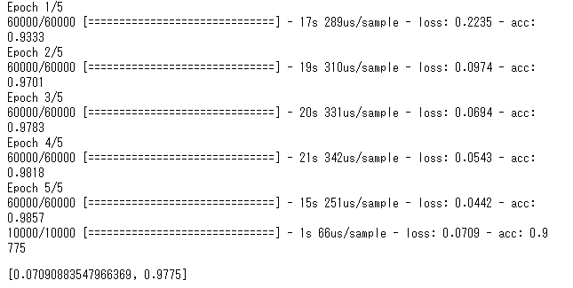

# 2019/03/20 週間レポート

## 目次

<!-- TOC depthFrom:2 -->

- [2019/03/20 週間レポート](#20190320-週間レポート)
  - [目次](#目次)
  - [AIの基礎知識についての学習](#aiの基礎知識についての学習)
    - [ディープラーニング](#ディープラーニング)
    - [Googleでのディープラーニング活用例](#googleでのディープラーニング活用例)
      - [参考ページ](#参考ページ)
    - [Googleが開発している機械学習フレームワーク「TensorFlow」](#googleが開発している機械学習フレームワークtensorflow)
      - [参考ページ](#参考ページ-1)
  - [TensorFlowとPythonでの学習](#tensorflowとpythonでの学習)
    - [チュートリアルの実践](#チュートリアルの実践)
      - [数字の手書き文字を判別](#数字の手書き文字を判別)
  - [今後の予定](#今後の予定)

<!-- /TOC -->

## AIの基礎知識についての学習

AIと呼ばれるものについての基礎知識を学習した。
AIの歴史と、現在主流である「ディープラーニング」について調べた。

### ディープラーニング

深層学習は人間の脳の神経細胞を模した「ニューラルネットワーク」で形成され、今までのAIよりも高度な判断や認識が可能。
画像認識や音声認識、自然言語処理などがこれに含まれる。

膨大な量の学習用データと処理能力が必要で、GoogleやApple、Amazon、Microsoft、Facebookなどの設備に余裕のある大手多国籍企業が開発を進めている。

### Googleでのディープラーニング活用例

[Googleアシスタント](https://assistant.google.com/intl/ja_jp/#?modal_active=none)は、ディープラーニングによる自然言語処理で成り立っている。
日本語にも対応しており、人による言い回しの違いや、発音の違い、曖昧な質問に対しても、高い精度で応答可能な優秀なアシスタントとなっている。

また、Googleでは[Googleフォト](https://www.google.com/intl/ja/photos/about/)でアップロードされた写真のタグ付を自動で行うなど、ディープラーニングをフルに活用している。

Googleはオフラインでディープラーニングの利用にも成功しており、Googleのスマートフォン「[Pixel](https://store.google.com/jp/product/pixel_3)」シリーズにはAI用チップを搭載し、データセンターの処理能力を借りることなく、学習済みのモデルを使って写真の補正や、バッテリーの管理、CPUの制御などを行っている。

「Google Clips」というカメラは「置いておくだけでベストショットが撮れる」新世代カメラで、ディープラーニングで培った人物認識や、ベストショットを見極める機能などが”完全オフライン”で実現されている。

#### 参考ページ

[Google アシスタント \- あなただけの Google](https://assistant.google.com/intl/ja_jp/#?modal_active=none)

[Google フォト \- 思い出を何枚でも保存、見たいときにはすぐに見つかる](https://www.google.com/intl/ja/photos/about/)

[Google Pixel 3 \- 日本 \- 世界を見る新しい方法 \- Googleストア](https://store.google.com/jp/product/pixel_3)

[スマートカメラ、Google Clipsレビュー――機械学習が人、イヌ、ネコ、ウサギを自動認識する \| TechCrunch Japan](https://jp.techcrunch.com/2018/02/28/2018-02-27-google-clips-review/)

### Googleが開発している機械学習フレームワーク「TensorFlow」

人工知能のトップを独走するGoogleが開発、利用しているのが「[TensorFlow](https://www.tensorflow.org/)」と言われるフレームワーク。
先程上げた「Pixel」シリーズや「Google Clips」にはTensorFlowの軽量版である「[TensorFlow Lite](https://www.tensorflow.org/lite)」が用いられている。

機械学習は学習に多くの時間が必要だが、Googleは「[TensorFlow Hub](https://www.tensorflow.org/hub)」で汎用的な”学習済みモデル”を多数公開しており、APIを叩くような感覚で利用可能。

差分のみを学習することで、使いたい用途に特化した人工知能を作成可能とのこと。

人工知能を勉強するに当たって、このTensorFlowとPythonを用いて学習を進めようと考えています。

#### 参考ページ
[TensorFlow](https://www.tensorflow.org/)

[TensorFlow Lite  \|  TensorFlow](https://www.tensorflow.org/lite)

[TensorFlow Hub  \|  TensorFlow](https://www.tensorflow.org/hub)

## TensorFlowとPythonでの学習

### チュートリアルの実践
まずはTensorFlowの公式ページに載っているチュートリアルを実践をしました。

#### 数字の手書き文字を判別
0～9までの数字の手書き文字データ6万件を学習させ、1万件のテストデータを判定するチュートリアルを実施し、実際の正答率を出してみました。

## 今後の予定

- 人工知能を利用して成功した事例を調べる
- TensorFlowの使い方を勉強する
- TensorFlow Hubの汎用モデルの使い方を勉強する
