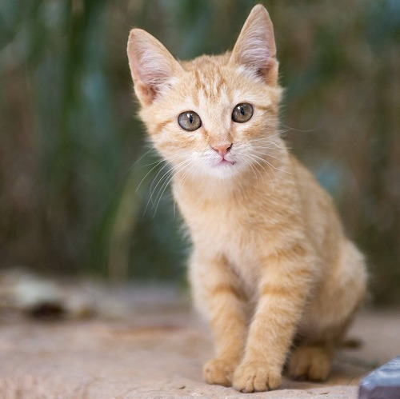
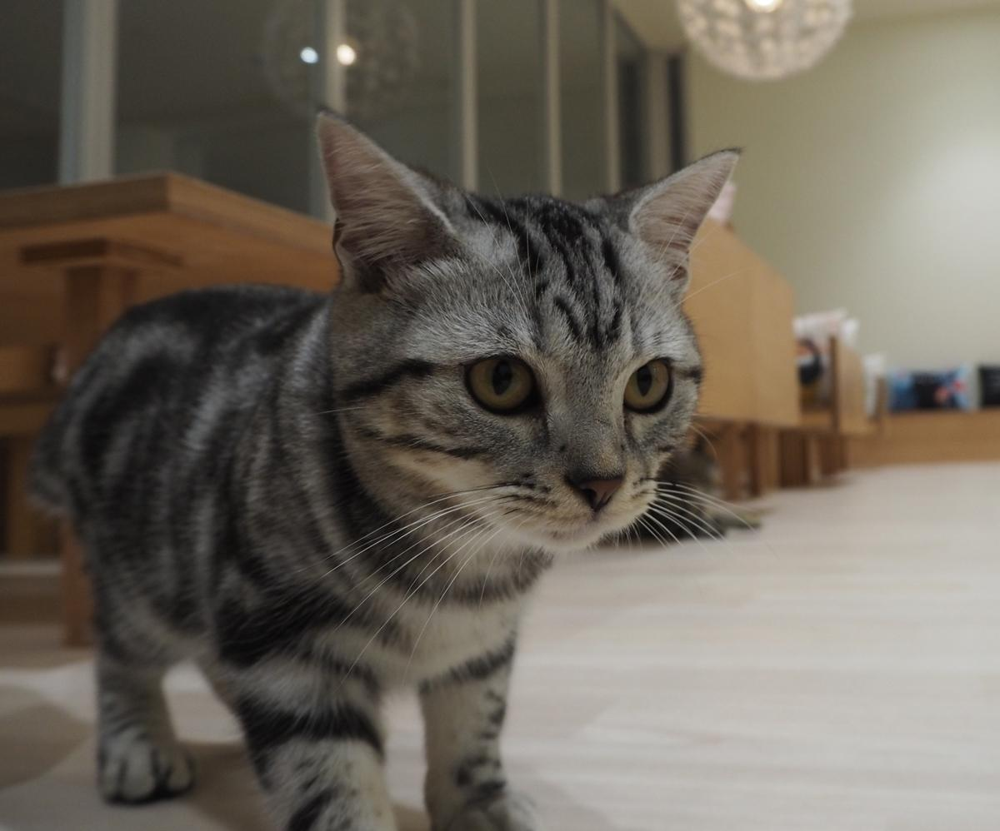
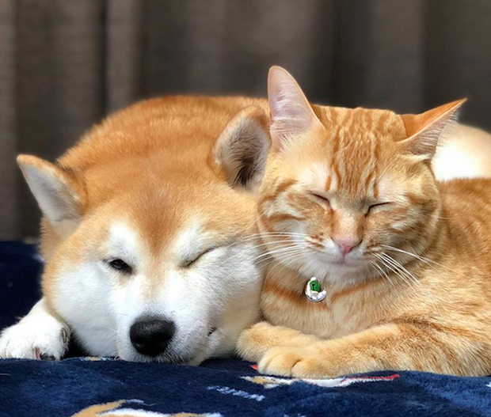
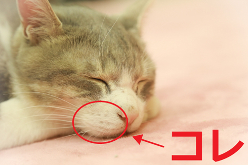
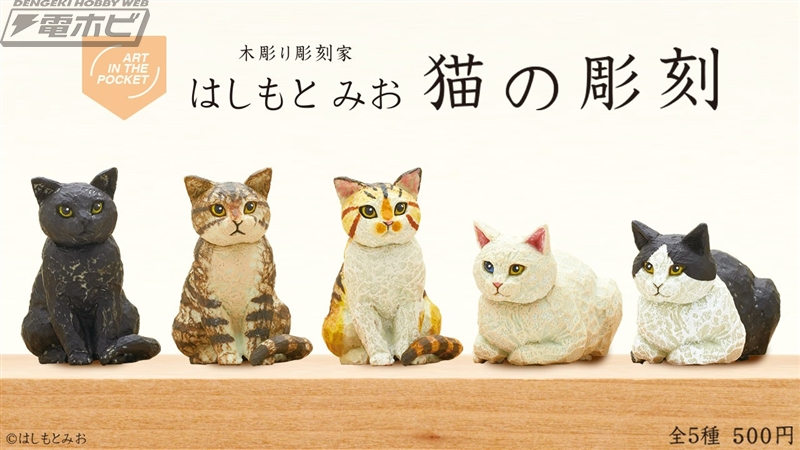
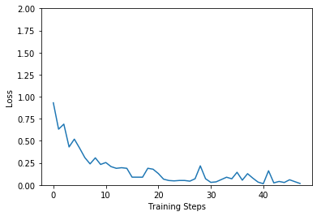
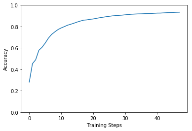
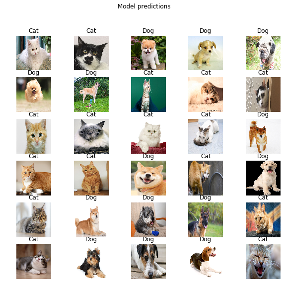

# 2019/04/04 週間レポート

## 目次

<!-- TOC depthFrom:2 -->

- [2019/04/04 週間レポート](#20190404-週間レポート)
  - [目次](#目次)
  - [TensorFlow Hub](#tensorflow-hub)
  - [「猫」と「犬」を判別するモデルの作成](#猫と犬を判別するモデルの作成)
    - [学習用画像の収集](#学習用画像の収集)
    - [追加学習用の画像データの選別基準](#追加学習用の画像データの選別基準)
      - [学習対象のデータ例](#学習対象のデータ例)
      - [除外対象のデータ例](#除外対象のデータ例)
    - [1500件ほどの画像データを学習させた結果](#1500件ほどの画像データを学習させた結果)
  - [今後の予定](#今後の予定)

<!-- /TOC -->

## TensorFlow Hub
TensorFlow HubはTensorFlowで学習させたモデルを共有できるプラットフォーム。
学習済みのモデルをベースに更に学習させたりすることで、短時間で特定分野に特化したモデルを作成できる。

まずはTensorFlow Hubで公開されている画像認識のモデルに追加学習を行って、何かを作ってみる。

## 「猫」と「犬」を判別するモデルの作成
手始めに「猫」と「犬」を判別するためのモデルを作成することにした。

TensorFlow Hubで公開されている学習済みモデルに、Google画像検索から収集した「猫」と「犬」の画像を教師あり学習で追加学習することで判別出来るようにする。

今回はGoogleが提供している「[imagenet/mobilenet_v2_100_224/feature_vector](https://tfhub.dev/google/imagenet/mobilenet_v2_100_224/feature_vector/2)
」の学習済みモデルを使用した。

このモデルは[ImageNet](http://image-net.org/index)の良質な学習用画像データを用いて学習したモデル。

### 学習用画像の収集

学習用の画像をすべて手動で収集すると莫大な時間と労力がかかるため、Pythonのツールで取得。

参考URL：[Googleから画像を一括でダウンロードするツール「google\-./images\-download」 \| cupOF Interests](https://co.bsnws.net/article/295)

「猫」「ねこ」「ネコ」「cat」など検索キーワードを少しずつ変えて1000件ずつ取得し、その中から学習対象以外の要素が多いものを目視で排除した。

最終的に「猫」と「犬」の画像、それぞれ750件ほどを学習データとして学習させた。

### 追加学習用の画像データの選別基準

今回の追加学習で使った画像の基準は以下の通り。

- 学習対象が単体で写っている
- 写真のみ
- 学習対象の特徴が視認できる（今回の場合は顔や輪郭など）
- 加工されてない

#### 学習対象のデータ例

猫が単体で写っており、特徴が視認できるため、学習対象。

#### 除外対象のデータ例

学習対象（猫）以外が写っている。

加工されている。

学習対象（猫）が複数写っている。

学習対象（猫）のイラスト

### 1500件ほどの画像データを学習させた結果
猫と犬の画像データを1500件ほど追加学習した結果が以下の通り。

損失率は学習を重ねるたびに減少し、徐々に収束している。

正答率も学習を重ねるごとに徐々に高くなっている。

学習データをランダムで30件選び、判定した結果では高い精度で判別できていることがわかる。

## 今後の予定
- 猫と犬を学習させたモデルを使用し、学習データ以外を判別させる
- 猫と犬を更に細かく分類し、猫種や犬種、子供や大人などを判別できるように学習データを増やしてみる
- TensorFlow Hubで共有されている学習済みモデルを使わずに、完全自作のモデルを作るために必要なことを調べる