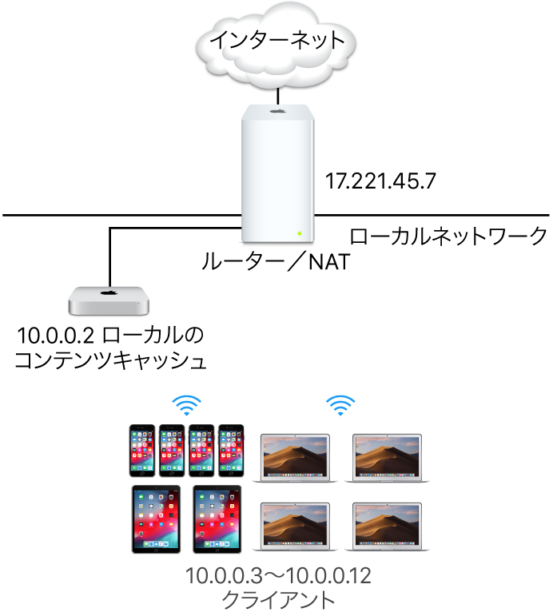
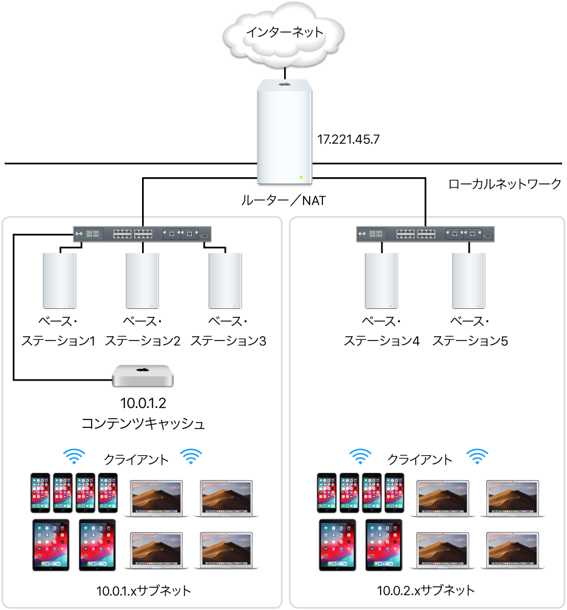
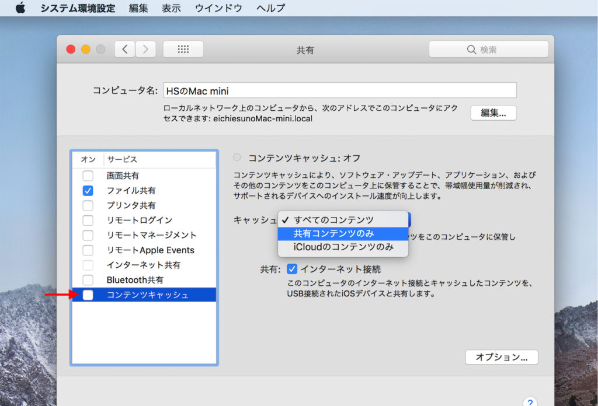
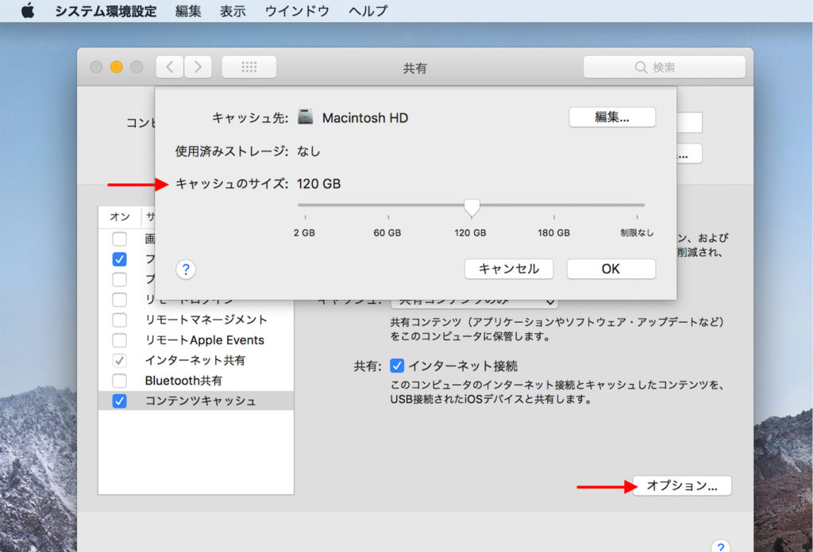
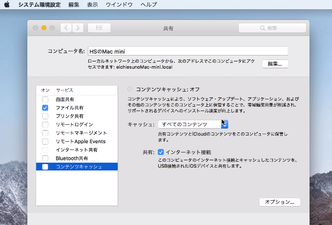
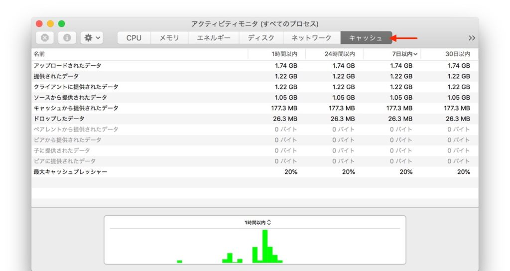

# Apple製品のアップデートを高速化する「コンテンツキャッシュ」のすゝめ

## 目次

<!-- TOC depthFrom:2 -->

- [目次](#目次)
- [コンテンツキャッシュとは？](#コンテンツキャッシュとは)
- [コンテンツキャッシュを使うための必須/推奨条件](#コンテンツキャッシュを使うための必須推奨条件)
    - [必須条件](#必須条件)
    - [推奨条件](#推奨条件)
- [仕組み](#仕組み)
    - [サブネットがある場合は？](#サブネットがある場合は)
- [コンテンツキャッシュの設定方法](#コンテンツキャッシュの設定方法)
- [コンテンツキャッシュを使う方法](#コンテンツキャッシュを使う方法)
- [コンテンツキャッシュが本当に使われているかを確認する方法](#コンテンツキャッシュが本当に使われているかを確認する方法)

<!-- /TOC -->

## コンテンツキャッシュとは？
macOS搭載端末に同じローカルネットワークに繋がっているmacOS、iOS、tvOSを搭載したデバイスがダウンロードしたデータをキャッシュし、他の端末でダウンロードする時にはローカルネットワーク上のコンテンツキャッシュからダウンロードすることで、ダウンロードを高速化する機能。

## コンテンツキャッシュを使うための必須/推奨条件

### 必須条件
- Mac : macOS 10.13 High Sierraがインストールされている。
- iOSデバイス : iOS 10.3以降がインストールされている。
-  対象のMac/iOSデバイスが同じローカルネットワークに接続されている。(ローカルネットワークのIPアドレスの定義は[RFC 1918](https://ja.wikipedia.org/wiki/%E3%83%97%E3%83%A9%E3%82%A4%E3%83%99%E3%83%BC%E3%83%88%E3%83%8D%E3%83%83%E3%83%88%E3%83%AF%E3%83%BC%E3%82%AF)に準拠)

RFC 1918に準拠するローカルIPアドレスは以下の範囲
- 10.0.0.0 〜 10.255.255.255（10/8 接頭辞）
- 172.16.0.0 〜 172.31.255.255（172.16/12 接頭辞）
- 192.168.0.0 〜 192.168.255.255（192.168/16 接頭辞）

上記の範囲外のIPアドレスを対象にする場合は、キャッシュとして利用するMacに対して別途設定が必要。

### 推奨条件
- Ethernet経由でMacがインターネットに接続されている。(Wi-Fiでも可能ですがパフォーマンスが低下します)
- システム環境設定の「共有」パネルの「コンテンツキャッシュ」で「インターネット接続を共有」が有効。

参考にしたページ
[macOS High Sierraで導入されたコンテンツキャッシュ機能を利用してMac miniをキャッシュサービスのペアレントにする。 \| AAPL Ch\.](https://applech2.com/archives/20180521-how-to-use-content-caching-on-mac-os.html)

## 仕組み

コンテンツキャッシュを利用したい端末と同じネットワークにコンテンツキャッシュを有効にしたMacを接続しておくだけで動作します。

Appleのサーバーからインターネット経由でダウンロードされるOTA(OSのアップデート)、iCloudに保存されている個人データ、iTunesストアで購入したコンテンツなどをMacのストレージにキャッシュします。

同じローカルネットワーク上の別の端末が同じデータを必要とした場合に、Macにキャッシュされたデータをローカルネットワークを利用してダウンロードすることで、ダウンロードを高速化することが出来ます。

### サブネットがある場合は？

サブネットがある場合でも、ローカルアドレスの範囲内であれば、コンテンツキャッシュの恩恵を受けることが可能です。

重要なのは、
「同じローカルネットワーク空間にコンテンツキャッシュされているMacが存在する」
「指定したローカルIPアドレス内にクライアントとコンテンツキャッシュが存在する」
の2点。

参考にしたページ
[Mac のコンテンツキャッシュについて \- Apple サポート](https://support.apple.com/ja-jp/guide/mac-help/mchl9388ba1b/10.14/mac/10.14)

## コンテンツキャッシュの設定方法

「システム環境設定」 → 「共有」 → 「コンテンツキャッシュ」を有効にする。

キャッシュの選択項目の詳細は以下の通り。

すべてのコンテンツ：Appleからダウンロードしたソフトウェア・アップデートとアプリケーション、および iCloud のコンテンツ。
共有コンテンツのみ：Appleからダウンロードしたソフトウェア・アップデートとアプリのみ。
iCloudのコンテンツのみ：写真や書類などのiCloudコンテンツのみ。

アップデートをキャッシュしたい時は「共有コンテンツのみ」でOK。
プライバシーの観点から不特定多数のユーザーが使うネットワークでは「共有コンテンツのみ」を選択するのが無難。

コンテンツキャッシュ画面右下の「オプション...」をクリックするとキャッシュに使う容量を設定可能。
キャッシュ容量が不足すると古いキャッシュから削除され、新たに必要なキャッシュを保存する。

より詳細な設定をする場合は、Optionキーを押しながら「オプション...」をクリックすることで「詳細オプション...」に変化し、詳細な設定が可能。

参考にしたページ
[macOS High Sierraで導入されたコンテンツキャッシュ機能を利用してMac miniをキャッシュサービスのペアレントにする。 \| AAPL Ch\.](https://applech2.com/archives/20180521-how-to-use-content-caching-on-mac-os.html)

## コンテンツキャッシュを使う方法

コンテンツキャッシュが有効になっているMacと同じローカルネットワークに参加し、iOS、macOSなどのアップデートやiCloudのデータ、iTunesコンテンツのダウンロードを行う。

ユーザーが意識することなく、ダウンロードするデータをキャッシュし、2回目以降のダウンロード時はコンテンツキャッシュから優先的にダウンロードを行う。

## コンテンツキャッシュが本当に使われているかを確認する方法

macOS 10.13.4 High Sierra以降であれば、コンテンツキャッシュを設定しているMacの「アクティビティモニタ」の「キャッシュ」タブでキャッシュされているデータ量やキャッシュから配信されたデータ量が確認可能。

「提供されたデータ」がローカルネットワークでダウンロードが行われた総データ量。
「キャッシュから提供されたデータ」がコンテンツキャッシュからダウンロードされた総データ量。

「提供されたデータ」 － 「キャッシュから提供されたデータ」 がインターネットからダウンロードされたデータ量。
「キャッシュから提供されたデータ」がインターネットからのダウンロードを削減しキャッシュから提供したデータ量。

参考にしたページ
[macOS High Sierraで導入されたコンテンツキャッシュ機能を利用してMac miniをキャッシュサービスのペアレントにする。 \| AAPL Ch\.](https://applech2.com/archives/20180521-how-to-use-content-caching-on-mac-os.html)