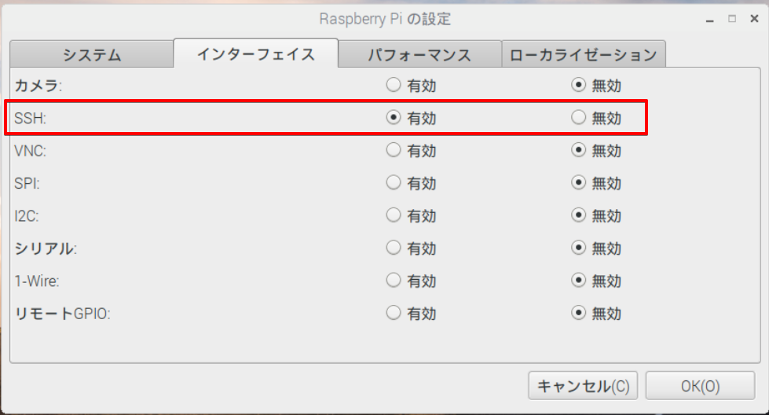
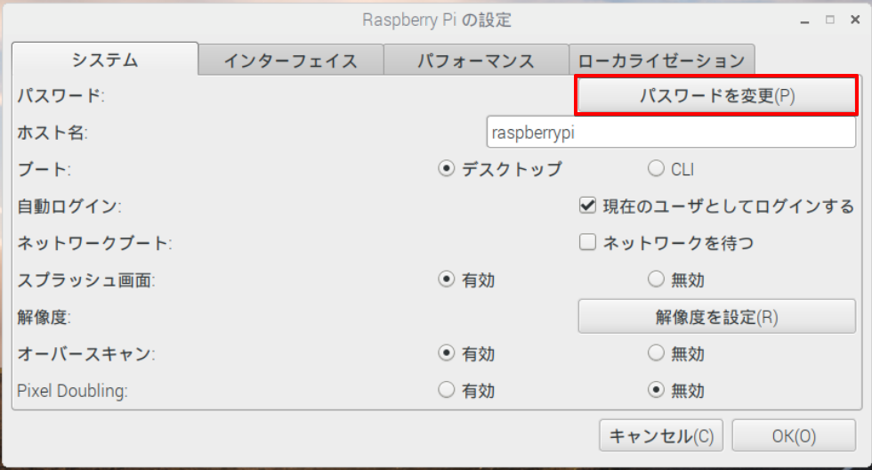
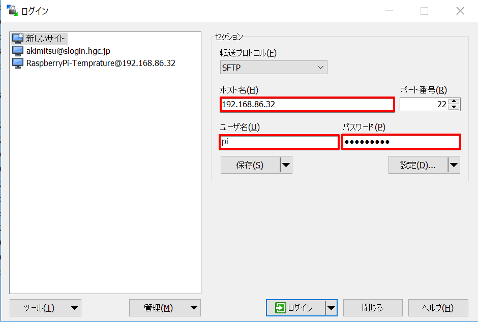

# Raspberry PiのSSH設定方法

## 目次

<!-- TOC depthFrom:2 -->

- [目次](#目次)
- [環境](#環境)
- [SSHとは？](#sshとは)
- [Raspberry PiでSSHの設定をする。](#raspberry-piでsshの設定をする)
    - [1. SSHディレクトリを作る](#1-sshディレクトリを作る)
    - [2. 「設定」→「Raspberry Piの設定」からSSHを有効に](#2-設定→raspberry-piの設定からsshを有効に)
    - [3.「設定」→「Raspberry Piの設定」からパスワードを変更](#3設定→raspberry-piの設定からパスワードを変更)
    - [3. WinSCPから接続してみる](#3-winscpから接続してみる)
    - [4. 鍵を使って接続できるようにする](#4-鍵を使って接続できるようにする)
    - [5. Raspberry Piに公開鍵を登録する](#5-raspberry-piに公開鍵を登録する)
    - [6. ベーシック認証を無効にする](#6-ベーシック認証を無効にする)
    - [7. パーミッションを確認する。](#7-パーミッションを確認する)

<!-- /TOC -->

<div style="page-break-before:always"></div>

## 環境
ハード
- ディスプレイ、マウス、キーボードを繋いである Raspberry Pi 3 Model B+
- Windows10が入ったマシン

ネットワーク
- 同一ローカルネットワークに接続済み

## SSHとは？

> Secure Shell（セキュアシェル、SSH）は、暗号や認証の技術を利用して、安全にリモートコンピュータと通信するためのプロトコル。パスワードなどの認証部分を含むすべてのネットワーク上の通信が暗号化される。
[Secure Shell \- Wikipedia](https://ja.wikipedia.org/wiki/Secure_Shell) より引用

暗号化とか認証とかを使って安全にリモートコンピュータに接続する仕組み。
その名の通り、シェルのセキュアなやつ。

パスワードによるベーシック認証も使えるが、基本的には公開鍵暗号を使って鍵で接続することが多い。

一通り設定が済んだらベーシック認証を無効化しておくのが吉。

<div style="page-break-before:always"></div>

## Raspberry PiでSSHの設定をする。

[Windows 10からRaspberry PiにSSH接続してみる（公開鍵認証） \- いろいろ試してみる](http://imamachi-n.hatenablog.com/entry/2018/06/17/104419)

基本的にはここを参照する。

### 1. SSHディレクトリを作る

Raspberry Piで以下のコマンドを実行。

`sudo mkdir /boot/ssh`

フォルダは空でOK。

### 2. 「設定」→「Raspberry Piの設定」からSSHを有効に



最近のRaspbianはデフォルトだとオフになってるらしい。

### 3.「設定」→「Raspberry Piの設定」からパスワードを変更



パスワードを変更する。
デフォルトは以下の通り。

| User | Password  |
| ---- | --------- |
| pi   | raspberry |


`sudo reboot`

<div style="page-break-before:always"></div>

### 3. WinSCPから接続してみる



以下の情報を入力して接続してみる。

ホスト名：IPアドレスかホスト名
ポート番号：変更していれば入力（デフォルトは22）
ユーザー名：pi
パスワード：さっき変えたやつ

繋がったらベーシック認証は設定完了。

### 4. 鍵を使って接続できるようにする

OpenSSHをインストールする。（Gitをインストールしてればついてきてるはず）

Git Bashから以下のコマンドを実行。（pathを通していればコマンドプロンプトでも可）

`ssh-keygen -t rsa -b 4096 -C "your_email@example.com"`

your_email@example.comは任意の値に変える。
（別にメールアドレスじゃなくてもいいけど、メールアドレスがベター）

保存先とかパスワードを求められるけど、何も入力せずEnter。

`C:\Users\ユーザ名\.ssh`に「id_sra」（秘密鍵）と「id_rsa.pub」（公開鍵）が作られる。

WinSCPで「id_rsa.pub」（公開鍵）をRaspberry Piにアップロードする。

<div style="page-break-before:always"></div>

### 5. Raspberry Piに公開鍵を登録する

```
# ホームディレクトリへ移動
cd ~

# 公開鍵をRaspberry Pi側に登録
mkdir .ssh
cat id_rsa.pub >> .ssh/authorized_keys

# 権限を設定
chmod 700 .ssh
chmod 600 .ssh/authorized_keys
```
**※権限の設定を間違うと接続できないので注意！**

SSHの設定を変更するために設定ファイルを編集する。

編集前に設定ファイルの権限を一時的に変更する。

`sudo chmod 777 /etc/ssh/sshd_config`

これでWinSCPからでも編集できるようになる。

`#PubkeyAuthentication yes`のコメントアウトを外す。
`#AuthorizedKeysFile  .ssh/authorized_keys .ssh/authorized_keys2`のコメントアウトを外す

```
#PubkeyAuthentication yes
~~~~~~~
#AuthorizedKeysFile  .ssh/authorized_keys .ssh/authorized_keys2
```
を
```
PubkeyAuthentication yes
~~~~~~~
AuthorizedKeysFile  .ssh/authorized_keys .ssh/authorized_keys2
```
って感じに変更する。

<div style="page-break-before:always"></div>

### 6. ベーシック認証を無効にする

`#PasswordAuthentication yes`のコメントアウトを外し、`no`に書きかえる。

```
#PasswordAuthentication yes
```
を
```
PasswordAuthentication no
```
って感じに変更する。

設定ファイルの編集が終わったらパーミッションを戻す。
`sudo chmod 644 /etc/ssh/sshd_config`


### 7. パーミッションを確認する。

以下のディレクトリやファイルのパーミッションを確認しておく。
**1つでも間違っていると接続できないので注意！**

| ディレクトリ         | パーミッション |
| -------------------- | -------------- |
| .ssh                 | 700            |
| .ssh/authorized_keys | 600            |
| /etc/ssh/sshd_config | 644            |

確認するのがめんどい場合は下のコマンドを流す。
```
cd ~
sudo chmod 700 .ssh
sudo chmod 600 .ssh/authorized_keys
sudo chmod 644 /etc/ssh/sshd_config
```

最後に再起動しておく。
`sudo reboot`