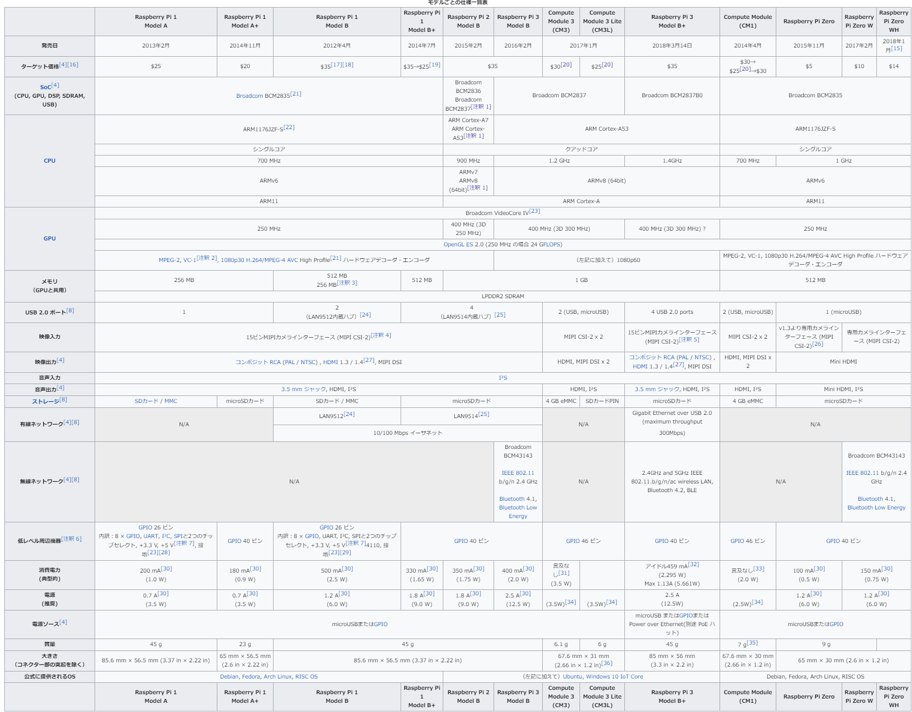
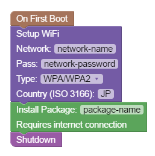

# Raspberry Pi 入門（セットアップから使えるようになるまで）

## 目次

<!-- TOC depthFrom:2 -->

- [目次](#目次)
- [Raspberry Piとは？](#raspberry-piとは)
- [Raspberry Piのモデルによる違い](#raspberry-piのモデルによる違い)
- [Raspberry Piでできること](#raspberry-piでできること)
    - [プログラムを動かす](#プログラムを動かす)
    - [センサーの値を読み取ったり、サーボを制御したり](#センサーの値を読み取ったりサーボを制御したり)
- [OSをインストールする](#osをインストールする)
- [Raspberry Piのヘッドレスセットアップに使えそうな便利ツール「PiBakery」](#raspberry-piのヘッドレスセットアップに使えそうな便利ツールpibakery)
    - [公式サイトからダウンロード](#公式サイトからダウンロード)
    - [インストールしたら起動してブロックを組み合わせるだけ。](#インストールしたら起動してブロックを組み合わせるだけ)
- [普通にインストールする](#普通にインストールする)

<!-- /TOC -->

## Raspberry Piとは？

Raspberry Pi Foundation（イギリス、ラズベリーパイ財団）が開発、販売するシングルボードコンピュータの一種。

日本では「ラズパイ」と略されることが多い。

「Raspberry」は果物の「ラズベリー」、「Pi」は料理の「パイ」を示すが、パイはスペルが若干異なる。
料理のパイの正しいスペルは「Pie」だが、Raspberry Piのパイは「Pi」と表記する。

Raspberry Piはシングルボードコンピュータとしては一番有名で、様々な分野で使われている。

簡単に言うと小さいパソコンのようなもので、LinuxベースのOSやWindowsなど多種多様なOSが動作する。

処理能力は低めだが、microUSBからの給電で動作するため、小規模なサービスのサーバーやIoT機器として用いられることが多い。

[Raspberry Pi \- Wikipedia](https://ja.wikipedia.org/wiki/Raspberry_Pi)

## Raspberry Piのモデルによる違い

Raspberry Piには複数のモデルが存在する。

ボード自体の大きさ、性能、機能などが異なっているため、用途によって使い分けられる。

現状一番スペックが高いのは「Raspberry Pi 3 Model B+」で日本での実売価格は5000円前後。

サイズに関してはRaspberry Pi Zeroシリーズが小さく、フリスクのケースに収まるほどの小型モデルだ。

[Raspberry Pi \- Wikipedia](https://ja.wikipedia.org/wiki/Raspberry_Pi)

## Raspberry Piでできること

### プログラムを動かす

OSを入れることでいろいろなプログラムを動かすことが出来ます。

PythonやJavaなんかを動かすことが多い気がする。

### センサーの値を読み取ったり、サーボを制御したり

普通のPCからセンサーの値を読み取ったり、サーボを制御しようと思うとアダプターとかゲートウェイとかが必要だが、Raspberry Piならそのあたりが必要なくなることもある。

Raspberry Piには「ピン」が搭載されており、ピンにセンサーやサーボなどを取り付けることで、直接制御することもできる。

さらにUSB端子やBluetooth、Wi-Fiも搭載しているので、USBデバイスやBluetooth搭載機器、Wi-Fiでのネットワーク通信なども使うことができる。

ピンに接続したセンサーやサーボをネットワーク経由で動かしたり、ログを取っておいたり、Raspberry Pi上でサーバーを立てておいて、サーバー上でなにかしたらサーボを制御したりなんかもできる。

このPCチックな使い方ができるのに、センサーやサーボに直接繋ぐことができるっていうあたりがRaspberry Piの強み。

## OSをインストールする

基本的にRaspberry Piはストレージを持たず、microSDをストレージとして使用する。

OSはmicroSDに書き込み、Raspberry Piからインストールすることになる。

## Raspberry Piのヘッドレスセットアップに使えそうな便利ツール「PiBakery」

ヘッドレスセットアップとはモニターを繋がずにセットアップすること。

通常ならRaspberry PiもPCと同じく、マウスやキーボード、モニターなどを繋いでセットアップするが、正直面倒なので楽にできるツール「PiBakery」を使ってみる。

はじめての起動時のみ実行、起動時には毎回実行などの条件でいろんな動作を自動化できる。

ブロックを組み合わせる感じで簡単に組み立てることができるのも楽で便利。

### 公式サイトからダウンロード

[Download PiBakery \- Downloads available for Windows, Mac, with Linux coming soon](https://www.pibakery.org/download.html)

まずは公式サイトからダウンロード。
Mac、Windows、Linuxに対応している。

Windows版で1.4GBほとあるので、ダウンロードにはそこそこ時間がかかる。

### インストールしたら起動してブロックを組み合わせるだけ。

こんな感じでブロックを組み合わせることで操作を指定できる。

上の例だと最初の起動時のみ、Wi-Fiの設定とパッケージのインストールを行い、その後シャットダウンするといった感じ。

詳しくない人でも[Scratch](https://scratch.mit.edu/)みたいな感じで簡単にセットアップできるからかなりハードルが下がりそう。

## 普通にインストールする

PiBakeryが使えない環境だったり、自作PCやってことある人なら普通にインストールするのもあり。

入れたいOSをmicroSDに焼くことでBootメディアを作成可能。

今回はRaspbianを入れる前提で話を進める。

1. Raspberry Pi公式サイトのダウンロードページからNOOBSかRaspbianをダウンロードする。
[Raspberry Pi Downloads \- Software for the Raspberry Pi](https://www.raspberrypi.org/downloads/)

2. SDカードを用意してフォーマットする。
3. [Etcher](https://www.balena.io/etcher/)を使って書き込む。
   使い方は見ての通りなので省略する。
4. microSDをぶち込んで電源ON

以上
