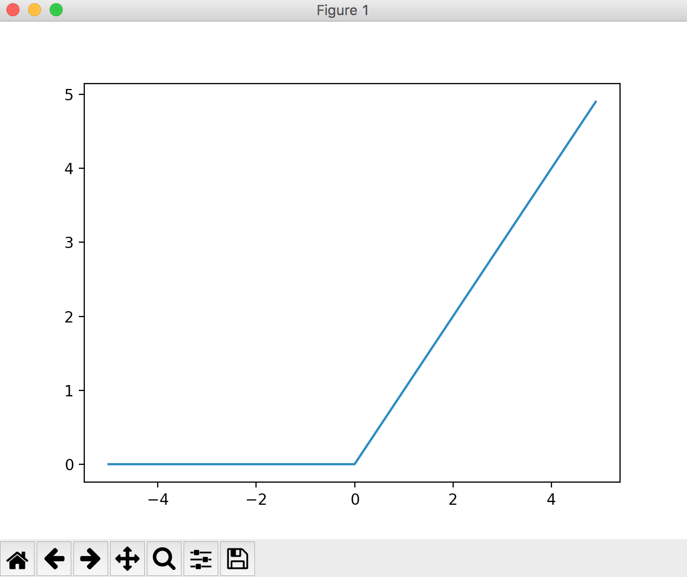
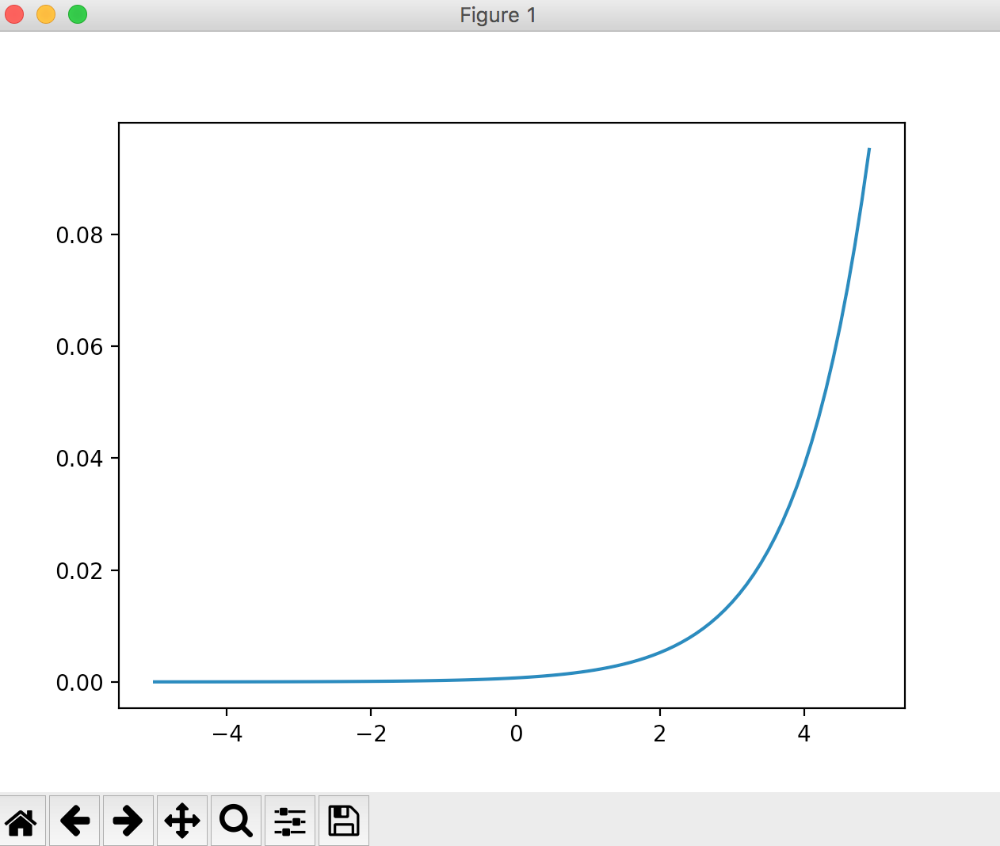

# TensorFlowの基礎

## 目次

<!-- TOC depthFrom:2 -->

- [TensorFlowの基礎](#TensorFlow%E3%81%AE%E5%9F%BA%E7%A4%8E)
  - [目次](#%E7%9B%AE%E6%AC%A1)
  - [モデルの定義](#%E3%83%A2%E3%83%87%E3%83%AB%E3%81%AE%E5%AE%9A%E7%BE%A9)
    - [tf.keras.layers.Flatten(input_shape=(28, 28))](#tfkeraslayersFlatteninputshape28-28)
    - [tf.keras.layers.Dense(128, activation=tf.nn.relu)](#tfkeraslayersDense128-activationtfnnrelu)
    - [tf.keras.layers.Dense(10, activation=tf.nn.softmax)](#tfkeraslayersDense10-activationtfnnsoftmax)
  - [モデルのコンパイル](#%E3%83%A2%E3%83%87%E3%83%AB%E3%81%AE%E3%82%B3%E3%83%B3%E3%83%91%E3%82%A4%E3%83%AB)
  - [学習の実行](#%E5%AD%A6%E7%BF%92%E3%81%AE%E5%AE%9F%E8%A1%8C)
  - [モデルの評価](#%E3%83%A2%E3%83%87%E3%83%AB%E3%81%AE%E8%A9%95%E4%BE%A1)
  - [AIが学習しすぎる？過学習を防ぐ方法](#AI%E3%81%8C%E5%AD%A6%E7%BF%92%E3%81%97%E3%81%99%E3%81%8E%E3%82%8B%E9%81%8E%E5%AD%A6%E7%BF%92%E3%82%92%E9%98%B2%E3%81%90%E6%96%B9%E6%B3%95)
  - [参考にしたページ](#%E5%8F%82%E8%80%83%E3%81%AB%E3%81%97%E3%81%9F%E3%83%9A%E3%83%BC%E3%82%B8)

<!-- /TOC -->

## モデルの定義

公式チュートリアル「MNISTデータを使った手書き文字の判別」の例

参考ページ
[TensorFlow Core  \|  TensorFlow](https://www.tensorflow.org/tutorials/)

```
model = tf.keras.Sequential([
    tf.keras.layers.Flatten(input_shape=(28, 28)),
    tf.keras.layers.Dense(128, activation=tf.nn.relu),
    tf.keras.layers.Dense(10, activation=tf.nn.softmax)
])
```
こんな感じで定義する。
書いた順番に層を積み重ねてくれるらしい？

```
model = tf.keras.Sequential()
model.add(tf.keras.layers.Flatten(input_shape=(28, 28)))
model.add(tf.keras.layers.Dense(128, activation=tf.nn.relu))
model.add(tf.keras.layers.Dense(10, activation=tf.nn.softmax))
```
`model = tf.keras.Sequential()`で定義してから`model.add~`で上に積み重ねていってもOK。

### tf.keras.layers.Flatten(input_shape=(28, 28))

```
tf.keras.layers.Flatten(input_shape=(28, 28))
```
`tf.keras.layers.Flatten`は平坦化するやつ

手書き文字データは2次元配列で格納されているので、それを1次元配列に変換する。

28 x 28pxの手書き文字データを0～255に数値化したものだから28 x 28の2次元配列に入っている。

だから`input_shape=(28, 28)`で28 x 28のデータだよって定義してあげる。

定義せずに`tf.keras.layers.Flatten()`で実行しても大丈夫だったから、2次元配列を1次元配列にさえできれば問題なさそう？

### tf.keras.layers.Dense(128, activation=tf.nn.relu)
```
tf.keras.layers.Dense(128, activation=tf.nn.relu)
```
よくわからんけど、多分重要な部分？
`activation=tf.nn.relu`で使用する関数を定義してる。

「ReLU関数」っていうのを使ってるっぽい？

以下がReLU関数の説明
>入力した値が0以下のとき0になり、1より大きいとき入力をそのまま出力します。



128っていうのが学習時に出す答えの数？

28 x 28の数値化された手書き文字データを平坦化(平坦化後 784個のデータ)
↓
128個に分類
↓
最終的に0～9の10種類に分類

って感じに判定してるっぽい？

### tf.keras.layers.Dense(10, activation=tf.nn.softmax)
```
tf.keras.layers.Dense(10, activation=tf.nn.softmax)
```

出力層の定義。
最終的には0～9の10種類の判定として出すので、「10」と定義。

`activation=tf.nn.softmax`で使用する関数を定義する。

softmax関数を使ってるみたい。
入力が0～9のどれかであるかを確立で出力するために使ってるっぽい？



## モデルのコンパイル

```
# モデルのコンパイル
model.compile(optimizer=tf.train.AdamOptimizer(),
              loss='sparse_categorical_crossentropy',
              metrics=['accuracy'])
```
こんな感じでコンパイルするっぽい？

・optimizer
モデルの最適化（？）を行う方法で、 AdamOptimizer が早いっぽい。

勾配降下法？の違いっぽい？
やり方の違いなので、あんまり気にしなくてもいいのかな？
[勾配降下法をざっくりと考えてみる \- Qiita](https://qiita.com/mine820/items/747a876d0bce658ad9ba)

TensorFlowで簡単に定義できるOptimizer一覧
[Module: tf\.keras\.optimizers  \|  TensorFlow](https://www.tensorflow.org/api_docs/python/tf/keras/optimizers)

・loss
値の近似値を得るための方法の定義とかそんなかんじ
[損失関数 \- Keras Documentation](https://keras.io/ja/losses/)

損失関数を定義するっぽい？
こっちもやり方の問題なので、特に気にする必要なさそう。
[損失関数について、ざっくりと考える \- Qiita](https://qiita.com/mine820/items/f8a8c03ef1a7b390e372)

TensorFlowなら英語で指定するだけでいいから、変えたければ適当にコピペすればOK。

TensorFlowで簡単に定義できるLoss関数一覧
[Module: tf\.losses  \|  TensorFlow](https://www.tensorflow.org/api_docs/python/tf/losses)

・metrics
わからん。

## 学習の実行

```
model.fit(x_train, y_train, epochs=5)
```

ここでは学習に使うデータと正解ラベル、学習回数のみを指定している。

```
model.fit(学習に使うデータ, 正解ラベル, epochs=学習回数)
```

詳しくはこの辺を参照する
[Modelクラス \(functional API\) \- Keras Documentation](https://keras.io/ja/models/model/)

## モデルの評価

```
loss, acc = model.evaluate(x_test, y_test)
```

実際に学習させたモデルをテストするときはこうする。

「acc」が正解率なので、これを上げるようにチューニングするのが重要。

詳しくはこの辺を参照する
[Modelクラス \(functional API\) \- Keras Documentation](https://keras.io/ja/models/model/)

## AIが学習しすぎる？過学習を防ぐ方法

AIが学習しすぎると**学習時に使ったデータ以外への正解率が下がる**現象が起こる。

これを「**過学習**」と呼び、汎用的なモデルを作るときには気をつける必要がある。

過学習を防ぐ手段としてはいろいろあるが、楽なのが「**一定確率でデータをドロップアウトすること**」らしい？

TensorFlowの場合は`tf.keras.layers.Dropout(0.2)`をモデルの定義時に入れると簡単にドロップアウトさせることが出来る。

0.2は何％のデータをドロップアウトするかを指定している。
0.2の場合は20%ってこと。

ドロップアウトと言っても、実際にデータを欠落させるわけではなく、あえて「**0**」を与えることで学習しすぎることを防ぐ。

## 参考にしたページ

[TensorFlow Core  \|  TensorFlow](https://www.tensorflow.org/tutorials/)

[MNIST データの仕様を理解しよう](https://weblabo.oscasierra.net/python/ai-mnist-data-detail.html)

[TensorFlow の勉強を始めたら最初にやる機械学習：MNIST手書き文字分類 \- いんでぃーづ](https://indie-du.com/entry/2018/10/30/190000)

[活性化関数のまとめ（ステップ、シグモイド、ReLU、ソフトマックス、恒等関数） \- Qiita](https://qiita.com/namitop/items/d3d5091c7d0ab669195f)

[損失関数について、ざっくりと考える \- Qiita](https://qiita.com/mine820/items/f8a8c03ef1a7b390e372)

[勾配降下法をざっくりと考えてみる \- Qiita](https://qiita.com/mine820/items/747a876d0bce658ad9ba)

[AIが学習しすぎる？「過学習」問題とそれを抑制する方法 \| AI入門ブログ（人工知能の作り方など人工知能に関する情報を公開）](https://ai-kenkyujo.com/2018/10/16/kagakushu/)